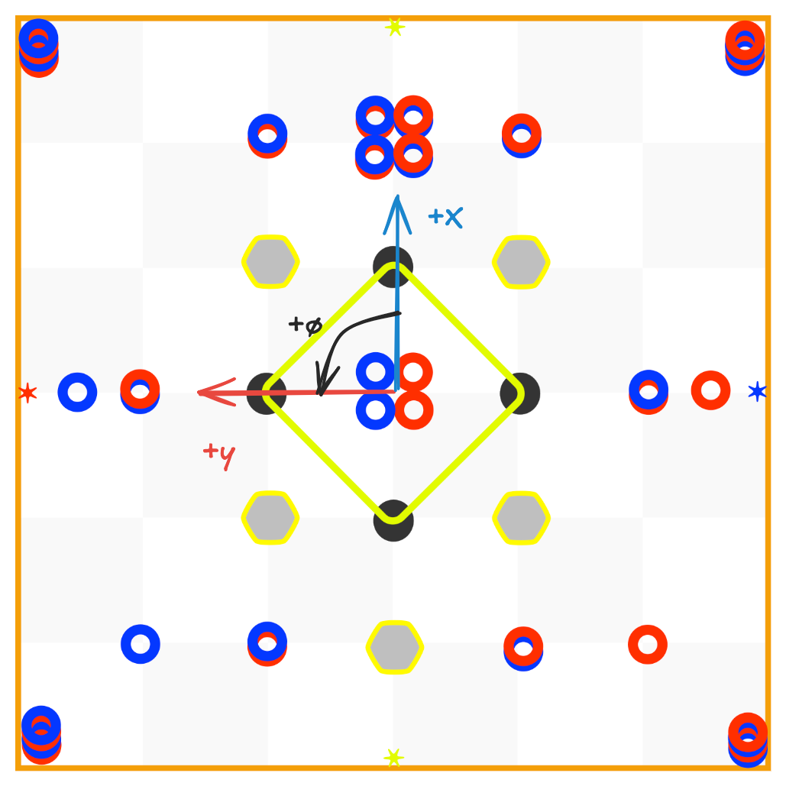

# A Note on Coordinates

For this library, we use a Cartesian coordinate system with the origin at the center of the field. The x-axis points to the head ref, and the y-axis points to the red alliance stake. The angle is measured in degrees, with 0° pointing to the head red and increasing counterclockwise. This system allows for easier coordinate flipping for the field mirroring this year and is similar to the official VEX API, while allowing easier math. All units are in SI, with position in meters and orientation in radians.

