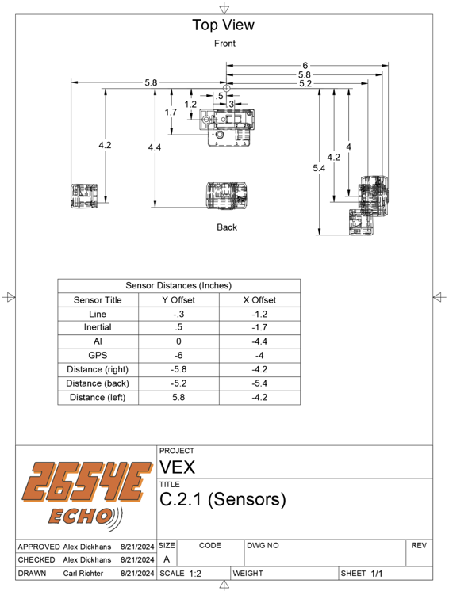

# Annotated Example

In this example we will make the code necessary for a Particle Filter. This is after you have installed Loco lib into
your local project. If it's not in your local project, use the [installation tutorial](./installation.md) to install it.

## Example Prerequisites

For this example you need to understand Basic C++ Programming, but more specifically, anonymous functions, object usage,
and lambda expressions. If you need to learn
the [learncpp.com](https://www.learncpp.com/cpp-tutorial/introduction-to-object-oriented-programming/) articles are
great places to learn!

## Setup

### Configuration

While you can set the configuration values when you use them, it is often helpful to have them all in the same spot.
For example, putting them at the top of the main.cpp, or another accessible spot can help with ease of use.

These tuning variables pertain just to how the drivetrain calculates how far it has travelled.

```c++
constexpr float DRIVE_RATIO = 48.0/36.0; // EX: 36 tooth driving gear to 48 tooth driven gear.
constexpr double DRIVETRAIN_TUNING_SCALAR = 76.0/87.9; // Tuning variable to make sure distance matches
constexpr QLength WHEEL_RADIUS = 3.25_in/2.0; // Wheel radius
```

These values are the noise values, we will discuss the noising process later in this tutorial, but it is crucial to a
working particle filter and must be > 0. We recommend you use similar values to these:

```c++
constexpr float DRIVE_NOISE = 0.35; // The desired amount in % of noise on the drive
constexpr Angle ANGLE_NOISE = 8_deg; // The noise on the angle that's desired
```

### Hardware definitions

Similar to configuration values, it's recommended that you put the port definitions at a easy to remember spot. In this
example we put them directly below the configuration values. A special note here is that there is a distance sensor
offset. This allows the distance sensor to be put anywhere on the robot and still give consistent positions. To ensure
we have reliable sensor positions we use a CAD drawing such as the following from our notebook to define the sensor
positions:



```c++
pros::MotorGroup left11W({-2, -3}), right11W({6, 7}); // left and right motor setup

// Create IMU and distance sensors
pros::Imu imu(19);
pros::Distance distance(18);

// Distance sensor pointed to the left, 5.8 inches to the left, and 4.2 inches back from the center of rotation
// A different distance offset needs to be used for each distance sensor
const Eigen::Vector3f DISTANCE_OFFSET((-4.2_in).getValue(), (5.8_in).getValue(), (90_deg).getValue());
```

### Particle filter initialization

Currently the particle filter implementation is in a form that is very flexible to the addition or utilization of
different sensors. This means that certain parts of it use lambda expressions to make the code simpler. The following
code creates a particle filter with 100 particles that uses the IMU laid flat as it's orientation source.

```c++
// Create a particle filter with 100 particles, and an angle function, given above
loco::ParticleFilter<100> particleFilter([]() {
    // Invert the angle into the loco coordinate system
    const Angle angle = -imu.get_rotation() * degree;

    // Check to make sure the angle isn't nan, if it is it can cause issues in the position change calculations
    return isfinite(angle.getValue()) ? angle : 0.0;
});
```

### Misc. Setup

Particle filters need a lot of noise to work properly, which we will describe in more detail later in this example, so
we use a ranlux24_base random number generator as our default engine (de).

```c++
// Cheap (computationally) random generator to add randomness to the drivetrain
std::ranlux24_base de;
```

Another thing we have to setup is the variables to store the last drivetrain state so it's possible to calculate the
change each frame. We will use this later in the tutorial.

```c++
// Used to calculate the change in position on the drivetrain
QLength lastLeft, lastRight;
```

Another thing we set up is a function to calculate the distance travelled of the drivetrain. To do this we use a function that takes in motor groups and calculates the average position, which we can use later to calculate the change in position in the local, and then global frames. 

```c++
/**
 * @brief get the average position of the motor group
 *
 * @param motor Motor group to get the distance travelled on
 * @return average position of the motor group
 */
QLength getDistance(const pros::MotorGroup& motor) {
    QLength totalPosition = 0.0;

    for (double position : motor.get_position_all()) {
        totalPosition += position / DRIVE_RATIO * 2.0 * M_PI
           * DRIVETRAIN_TUNING_SCALAR * WHEEL_RADIUS;
    }

    return totalPosition/motor.size();
}
```

